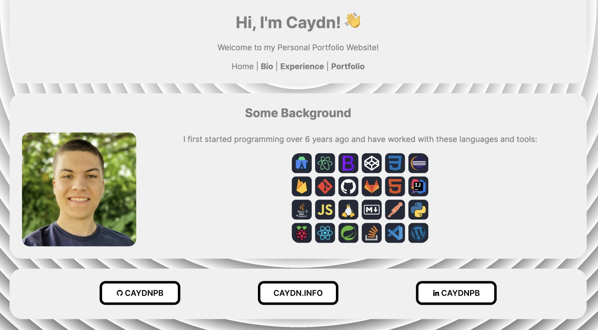

<h1 align="center">Personal Portfolio Website</h1>

  <h2>Background</h2>
  

 

  👨‍💻 This repository was created as a part of my <a href="https://www.multiverse.io/en-GB/programmes/software-engineering" draggable="false">Multiverse Bootcamp</a>

  <h2>Screenshot</h2>
  

 

  

  

 

  

